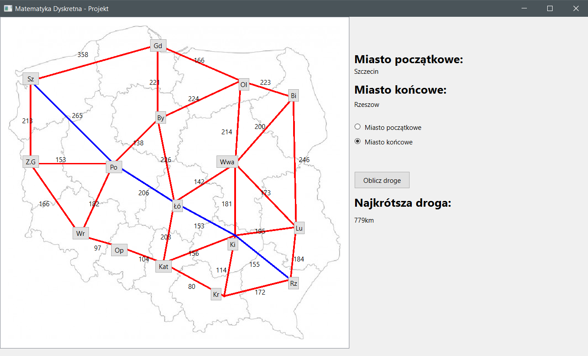

<!-- ABOUT THE PROJECT -->
## About The Project

This app show you the shortest path between two polish cities. The user must indicate the start city and destination city. The program uses Qt framework. To calculate shortest path the Dijkstra's algorithm was used. The algorithm is performed on graph. This graph is represented in memory as adjacency list.

